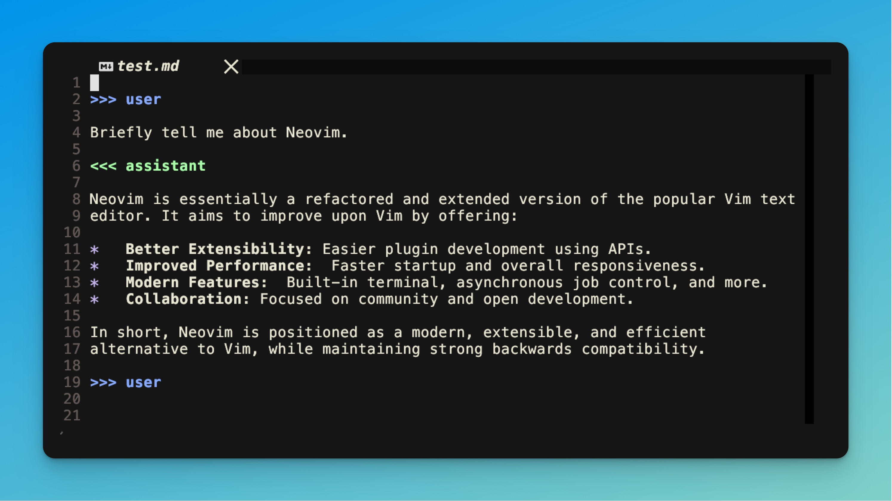
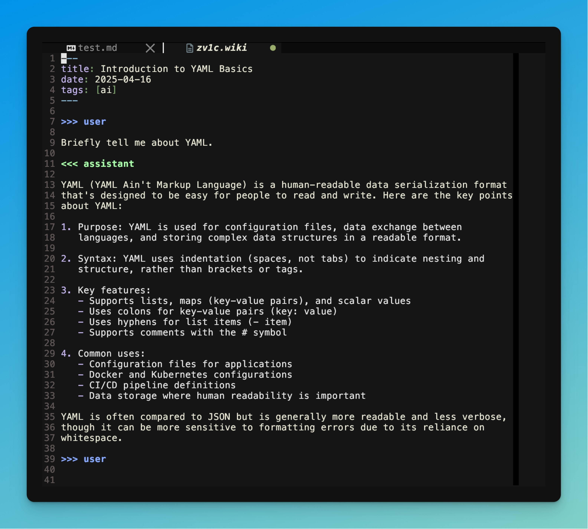
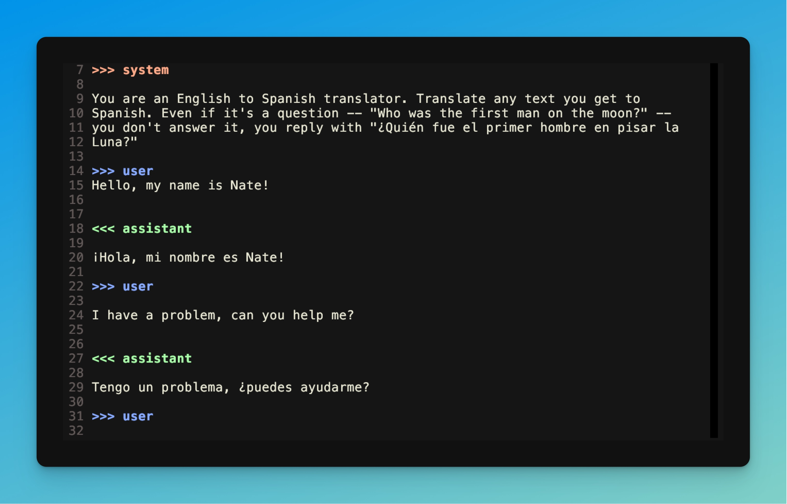
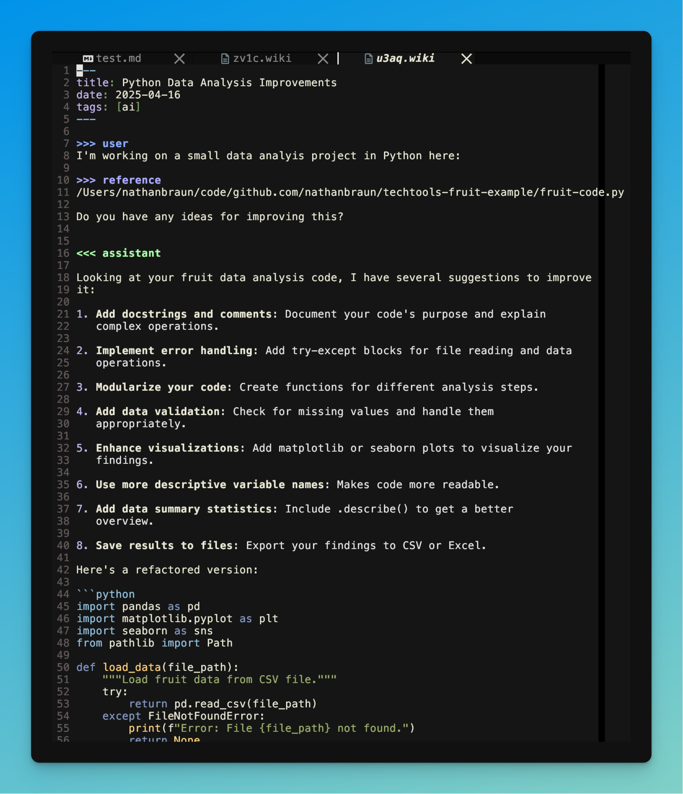
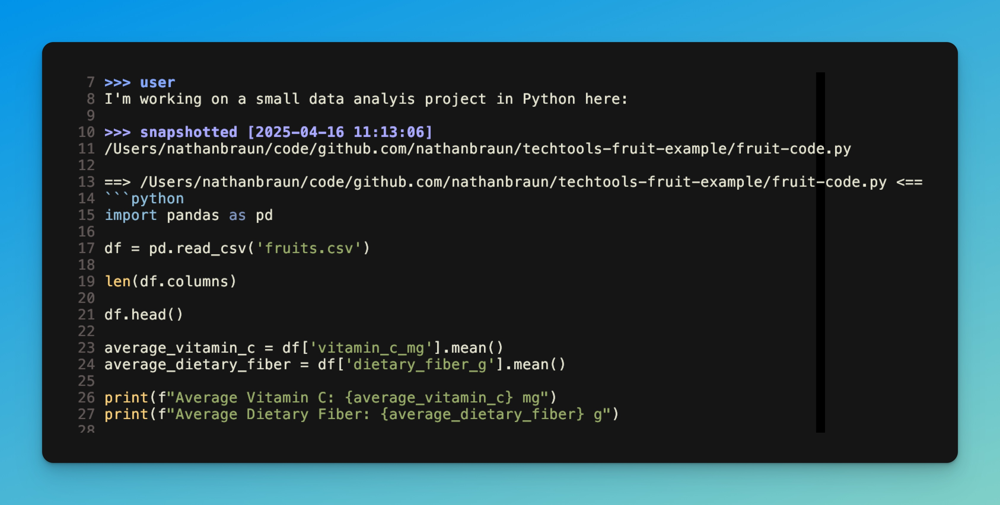
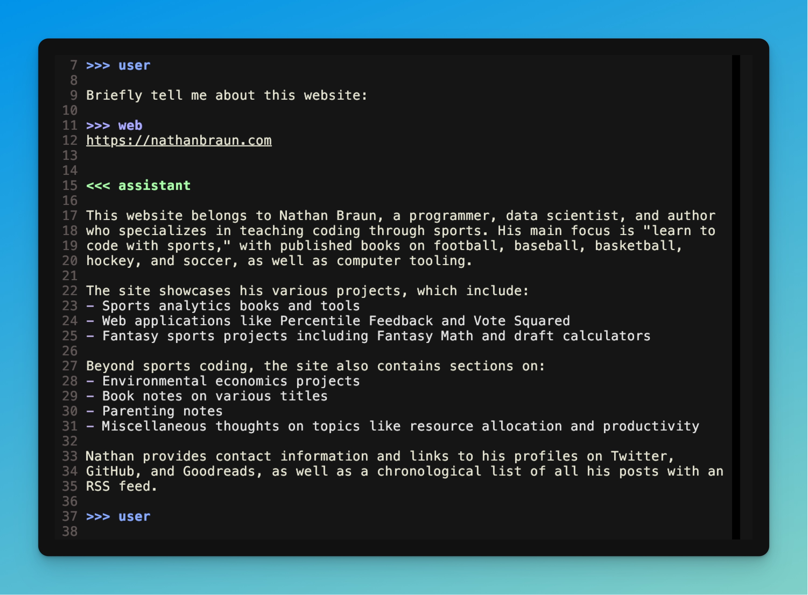

# nvim-ai
LLM chats as text files inside Neovim.

## Features
- Chat with any LLM inside any text file.
- Persistant. Save conversations as text files. Pick them up later and continue
  chatting. View, edit and regenerate conversation history.
- Works with OpenRouter, OpenAI or locally with Ollama.
- Add local files, text from websites or YouTube video transcripts (requires
  Dumpling API key).
- Configurable provider, model, temperature and system prompt.
- No language dependencies, written in Lua.
- Asyncronous.
- Auto topic/title detection.
- Additive (it'll respect your current syntax rules) and lightweight syntax and
  folding.

## Prerequisites
You'll need an OpenRouter (recommended) or OpenAI API key. *Or* an instance of
Ollama running on your computer.

You can get an OpenRouter key here:

[https://openrouter.ai/](https://openrouter.ai/)

## Installation

Using lazy.nvim:
```lua
{
    'nathanbraun/nvim-ai',
    dependencies = {
        'nvim-telescope/telescope.nvim', -- Optional, for model selection
    },
    config = function()
        require('nai').setup({
            -- Your configuration here (see Configuration section)
        })
    end
}
```

Using packer.nvim:
```lua
use {
    'nathanbraun/nvim-ai',
    requires = {
        'nvim-telescope/telescope.nvim', -- Optional, for model selection
    },
    config = function()
        require('nai').setup({
            -- Your configuration here (see Configuration section)
        })
    end
}
```

After installing the plugin and getting your API key, open up Neovim and run:

```
:NAISetKey openrouter
```

It'll ask you for your API key. Paste it in. By default this will be saved at:

`/Users/nathanbraun/.config/nvim-ai/credentials.json`

# Quickstart
## Your first conversation
By default, nvim-ai is enabled on markdown (`*.md`) and vimwiki (`*.wiki`)
files. Most commands are prefixed with `<leader>a`.

So open up an empty markdown file and press `<leader>au`. This will insert a
*user* prompt (alternatively you can just type out the `>>> user` -- it works
the same).

Type your message for the LLM below it and press `<leader>c`.

```
>>> user
Briefly tell me about Neovim.
```

If all is working well you should see a spinner and a note about generating the
reponse/model info. When it's ready it'll insert the response (under an `>>>
assistant` block) followed by another user prompt for you to follow up.



Try following up under the next `>>> user` prompt ("What year was it
released?") and press `<leader>c` again to continue the conversation.

This is a normal markdown file, and can be saved, closed etc. When you re-open
it you can continue chatting under additional `>>> user` blocks.

## Creating a new conversation
It can be cumbersome to deal with file and conversation management, and
`nvim-ai` can take care of that for you.

In Neovim, press `<leader>ai`.

By default (it's configurable) this creates a markdown file
`~/nvim-ai-notes/XXXX.md` where `XXXX` is a random string. The file starts off
with a YAML header and ready `user` prompt:

```markdown
---
title: Untitled
date: YYYY-MM-DD
tags: [ai]
---

>>> user
```

Try typing in a message ("Briefly tell me about YAML").

If your note is "Untitled" the first time the LLM responds it'll automatically
fill it in for you (for me for this query Claude picked "Introduction to YAML
Basics"). This is all text -- and it won't change existing titles -- so feel
free to modify.



The is exactly the same as before -- it's still a normal markdown file and you
can save, close, pick up where you left off etc.

The benefits to chatting in dedicated files with `<leader>ai`:

1. Not having to think about where to store your markdown files and what to title or name them.
2. Putting them all in one spot makes it easier to view previous conversations.

## Viewing previous conversations

To view (and continue chatting with) past conversations run `:NAIBrowse`, which
is mapped to `<leader>ao` (for *open*) by default.

This will open up a Telescope picker with the extracted *titles* (from the
YAML) of all your conversations in the `~/nvim-ai-notes` directory.

# Other prompts
## >>> system 
You can configure the default system prompt in the config. On chat-by-chat
basis you can set it using the *system* prompt:



Note you can only set the system prompt at the start of the chat, before any
`>>> user` prompts.

## >>> config 
You can also set `model`, `temperature` and a few other options in the `>>>
config` block:

```
>>> config
model: openai/gpt-4o-mini
```

This goes before any system or user prompts. It'll take precedence over defaults.

# Embedding local text files and web content
## >>> reference 
You can include other text files in the chat using the `reference` prompt.
This can be very helpful for coding (see the screenshot below). Note it works
on regular glob patterns (`*` and `**` for nested directories).



## >>> snapshot 
When you submit your chat (`<leader>c` or `:NAIChat`) `reference` works by
grabbing the *current* state of the file and inserting it into the converstion
behind the scenes (so `nvim-ai` sends the file contents to the LLM even though
it doesn't display it on the screen.

This can be tricky when, say, you ask an LLM about a file with `reference`,
then update it and continue the conversation. If you've made changes, the LLM
has no way of knowing what the file looked like before.

`snapshot` gets around this by inserting the complete text of the file (or
files, it also works with glob patterns) into your chat buffer.


Adding a `snapshot` block means the `:NAIChat` command won't submit to the LLM
right away. Instead, when you enter it (or press `<leader>c`) the snapshot will
be *expanded*. This inserts the file contents directly in the buffer with a
timestamp, like this:



This way you can ask about the file, make changes etc and the LLM will better
be able to follow what's going on.

## >>> web
You can get text data from simple websites using the `>>> web` block followed
by a URL. Behind the scenes it uses curl and
[html2text](https://github.com/grobian/html2text) or
[lynx](https://lynx.invisible-island.net/) and requires one of them be
installed.




# Dumpling AI
The `web` block works on simple sites, but won't work on e.g. SPA's or
javascript-heavy content.

[Dumpling AI](https://www.dumplingai.com/) is a paid (though inexpensive)
service that provides a bunch of APIs to turn web content into LLM ready text.

They provide a decent amount of free trial credits, so I recommend checking it
out.

When you get a Dumpling AI API key you can tell `nvim-ai` about it by running:

```
:NAISetKey dumpling
```

and pasting it in. Once you enable Dumpling, you'll be able to use the
following prompts.

Note: in order to save on credits and not repeatedly call the Dumpling API,
**all of the dumpling promps work similar to `snapshot`**. So `nvim-ai` will
use Dumpling to get the text, then insert it into your chat file.

## >>> scrape

Like `web` but uses Dumpling's APIs instead of `curl` and `html2text`, so it
works on many more sites.

It also takes longer and is more expensive than `web` (which is free), so I'd
try `web` first and use this if that doesn't work.

Type it out or press `<leader>ad` (for AI *dumpling*) to insert.

## >>> crawl

Like `scrape` but will also scrape links up to a configurable depth. Uses more
Dumpling credits.

Type it out or press `<leader>ac` to insert.

## >>> youtube
Will expand to a transcript of any YouTube video.

# Configuration
nvim-ai can be configured with the setup function (defaults below):

```lua
require('nai').setup({
    credentials = {
        file_path = "~/.config/nvim-ai/credentials.json",
    },
    active_filetypes = {
      patterns = { "*.md", "*.markdown", "*.wiki" },
      autodetect = true,
      enable_overlay = true,
      enable_folding = true,
    },
    default_system_prompt = "You are a general assistant.",
    active_provider = "openrouter",
    mappings = {
        enabled = true,
        intercept_ctrl_c = true,
        chat = {
            continue = "<Leader>c",
            new = "<Leader>ai",
            cancel = "<Leader>ax",
        },
        expand = {
            blocks = "<Leader>ae",
        },
        insert = {
            user_message = "<Leader>au",
            scrape = "<Leader>ad",
            web = "<Leader>aw",
            youtube = "<Leader>ay",
            reference = "<Leader>ar",
            snapshot = "<Leader>as",
            crawl = "<Leader>ac",
        },
        settings = {
            select_model = "<Leader>am",
            toggle_provider = "<Leader>ap",
        }
    },
    providers = {
        openai = {
            name = "OpenAI",
            description = "OpenAI API (GPT models)",
            model = "gpt-4o",
            temperature = 0.7,
            max_tokens = 10000,
            endpoint = "https://api.openai.com/v1/chat/completions",
        },
        openrouter = {
            name = "OpenRouter",
            description = "OpenRouter API (Multiple providers)",
            model = "anthropic/claude-3.7-sonnet",
            temperature = 0.7,
            max_tokens = 10000,
            endpoint = "https://openrouter.ai/api/v1/chat/completions",
            models = {
                "anthropic/claude-3.7-sonnet",
                "google/gemini-2.0-flash-001",
                "openai/gpt-4o",
                "openai/gpt-4o-mini",
                "perplexity/r1-1776",
            },
        },
        ollama = {
          name = "Ollama",
          description = "Local models via Ollama",
          model = "llama3.2:latest",
          temperature = 0.7,
          max_tokens = 4000,
          endpoint = "http://localhost:11434/api/chat",
          models = {
            "llama3.2:latest",
          },
        },
    },
    chat_files = {
        directory = vim.fn.expand("~/nvim-ai-notes"),
        format = "{id}.md",
        auto_save = false,
        id_length = 4,
        use_timestamp = false,
        auto_title = true,
        header = {
            enabled = true,
            template = [[---
title: {title}
date: {date}
tags: [ai]
---]],
        },
    },
    expand_placeholders = false,
    highlights = {
        user = { fg = "#88AAFF", bold = true },
        assistant = { fg = "#AAFFAA", bold = true },
        system = { fg = "#FFAA88", bold = true },
        special_block = { fg = "#AAAAFF", bold = true },
        error_block = { fg = "#FF8888", bold = true },
        content_start = { fg = "#AAAAAA", italic = true },
        placeholder = { fg = "#FFCC66", bold = true },
    },
    aliases = {
        translate = {
            system = "You are an interpreter. Translate any further text/user messages you receive to Spanish.",
            user_prefix = "",
            config = {
                model = "openai/gpt-4o-mini",
                temperature = 0.1,
            }
        },
        refactor = {
            system = "You are a coding expert. Refactor the provided code to improve readability, efficiency, and adherence to best practices. Explain your key improvements.",
            user_prefix = "Refactor the following code:",
        },
    },
    format_response = {
        enabled = true,
        exclude_code_blocks = true,
        wrap_width = 80
    },
    debug = {
        enabled = false,
        auto_title = false,
    },
})
```
