# nvim-ai
LLM chats as text files inside Neovim.

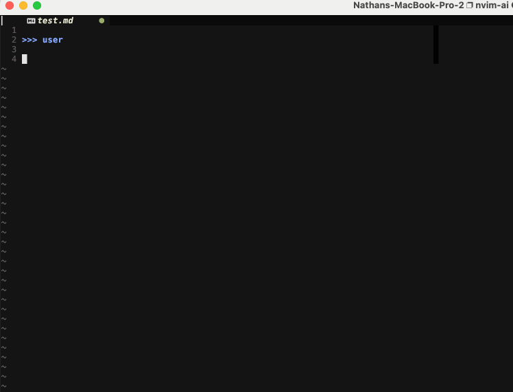

## Features
- Chat with any LLM inside any text file.
- Persistent. Save conversations as text files. Pick them up later and continue
  chatting. View, edit and regenerate conversation history.
- Works with OpenAI, Google, OpenRouter, locally with Ollama, or via Claude Max subscription.
- Configurable provider, model, temperature and system prompt.
- No language dependencies, written in Lua.
- Asynchronous.
- Auto topic/title detection.
- Lightweight (it'll respect your current syntax rules) syntax and folding.

## Table of Contents
- [Prerequisites](#prerequisites)
- [Creating a new conversation](#creating-a-new-conversation)
- [Viewing previous conversations](#viewing-previous-conversations)
- [Changing models](#changing-models)
- [Other prompts](#other-prompts)
- [Embedding local text files](#embedding-local-text-files)
- [Alias blocks](#>>>-alias-blocks)
- [Escaping chat markers](#escaping-chat-markers)
- [Configuration](#configuration)
- [Health Check](#health-check)

## Prerequisites
You'll need one of the following:
- A **Claude Pro or Max** subscription with the Claude CLI installed (see
  [setup instructions](#claude-pro-or-max-via-local-proxy) below)
- An **OpenRouter** API key (recommended for API access — one key, many models)
- An **OpenAI** or **Google AI** API key
- A local **Ollama** instance

You can get an OpenRouter key here:

[https://openrouter.ai/](https://openrouter.ai/)

## Installation

<details>
  <summary>lazy.nvim</summary>

```lua
{
    'nathanbraun/nvim-ai',
    dependencies = {
        'nvim-telescope/telescope.nvim', -- Optional, for model selection
    },
    config = function()
        require('nai').setup({
            -- Your configuration here (see Configuration section)
        })
    end
}
```
</details>

<details>
  <summary>packer.nvim</summary>

```lua
use {
    'nathanbraun/nvim-ai',
    requires = {
        'nvim-telescope/telescope.nvim', -- Optional, for model selection
    },
    config = function()
        require('nai').setup({
            -- Your configuration here (see Configuration section)
        })
    end
}
```
</details>

### API key providers (OpenRouter, OpenAI, Google)

After installing the plugin and getting your API key, open up Neovim and run:

```
:NAISetKey openrouter
```

It'll ask you for your API key. Paste it in. By default this will be saved at:

`~/.config/nvim-ai/credentials.json`

### Claude Pro or Max (via local proxy)

If you have a Claude Pro ($20/mo) or Max subscription, you can use Claude
directly without an API key. This works by running a small local proxy server
that forwards requests through the Claude CLI.

**Requirements:**
- A [Claude Pro or Max](https://claude.ai/upgrade) subscription
- The [Claude CLI](https://docs.anthropic.com/en/docs/claude-cli) (if you
  have Claude Code installed, the CLI is already available)
- Python 3

**Setup:**

1. Make sure the Claude CLI is installed and authenticated:
   ```
   claude login
   ```

2. Set your provider in your Neovim config:
   ```lua
   require('nai').setup({
       active_provider = "claude_proxy",
       active_model = "sonnet",  -- or "opus", "haiku"
   })
   ```

That's it. The plugin will automatically start the proxy server when Neovim
launches and you'll see a confirmation message ("Claude proxy started on
:5757"). You can verify everything is working with `:checkhealth nai`.

To disable auto-start (e.g., if you manage the proxy yourself), set
`auto_start = false` in the provider config:

```lua
providers = {
    claude_proxy = {
        auto_start = false,
    },
}
```

**Note:** Claude Pro has lower usage limits than Max. If you hit rate limits
frequently, consider upgrading to Max or using an API provider like
OpenRouter.

# Quickstart
## Your first conversation
By default, nvim-ai is enabled on markdown (`*.md`) and vimwiki (`*.wiki`)
files.

Most commands are prefixed with `<leader>a`.

So open up an empty markdown file and press `<leader>au`. This will insert a
*user* prompt (alternatively you can just type out `>>> user` -- it works the
same).

Type your message for the LLM below it and press `<leader>c`.

```
>>> user

Briefly tell me about Neovim.
```

If all is working well you should see a spinner and a note about generating the
response/model info. When it's ready it'll insert the response (under an `<<<
assistant` block) followed by another user prompt for you to follow up.

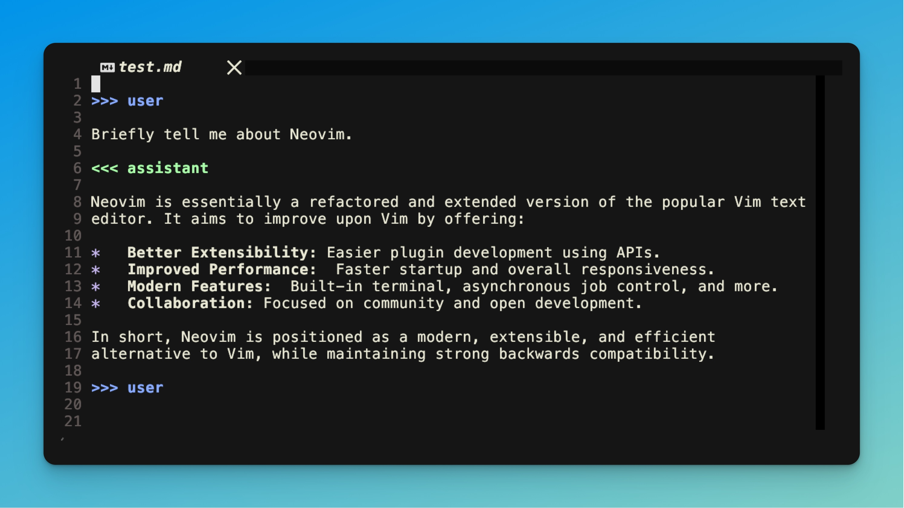

Try following up under the next `>>> user` prompt ("What year was it
released?") and press `<leader>c` again to continue the conversation.

This is a normal markdown file, and can be saved, closed etc. When you re-open
it you can continue chatting under additional `>>> user` blocks.

## Creating a new conversation
It can be cumbersome to deal with file and conversation management, and
`nvim-ai` can take care of that for you.

In Neovim, press `<leader>ai`.

By default (it's configurable) this creates a markdown file
`~/nvim-ai-notes/XXXX.md` where `XXXX` is a random string. The file starts off
with a YAML header and ready `user` prompt:

```markdown
---
title: Untitled
date: YYYY-MM-DD
tags: [ai]
---

>>> user
```

Try typing in a message ("Briefly tell me about YAML") and `:NAIChat`
(`<leader>c`) to send to the LLM.

If your note is "Untitled" the first time the LLM responds it'll automatically
fill it in for you (for me for this query Claude picked "Introduction to YAML
Basics"). This is all text -- and it won't change existing titles -- so feel
free to modify.

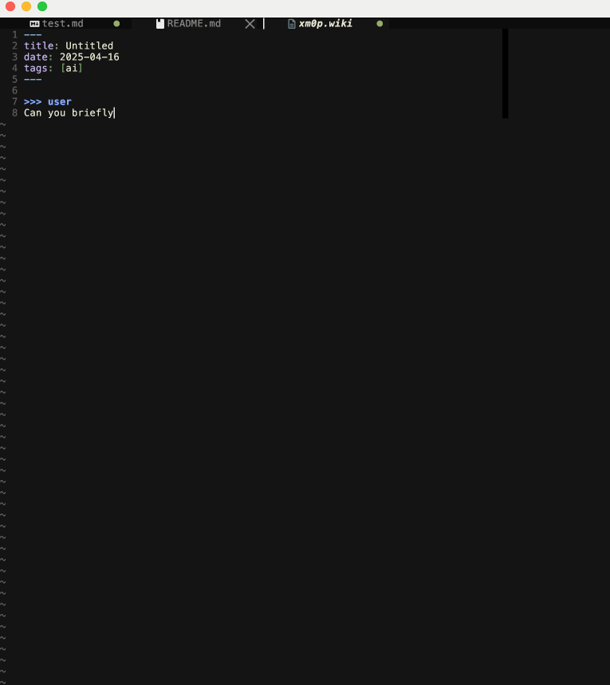

The is exactly the same as before -- it's still a normal markdown file and you
can save, close, pick up where you left off etc.

The benefits to chatting in dedicated files with `<leader>ai`:

1. Not having to think about where to store your markdown files and what to title or name them.
2. Putting them all in one spot makes it easier to view previous conversations.

## Viewing previous conversations

To view (and continue chatting with) past conversations run `:NAIBrowse`, which
is mapped to `<leader>ao` (for *open*) by default.

This will open up a picker (Snacks, Telescope or Fzf Lua) with the extracted
*titles* (from the YAML) of all your conversations in the `~/nvim-ai-notes`
directory.

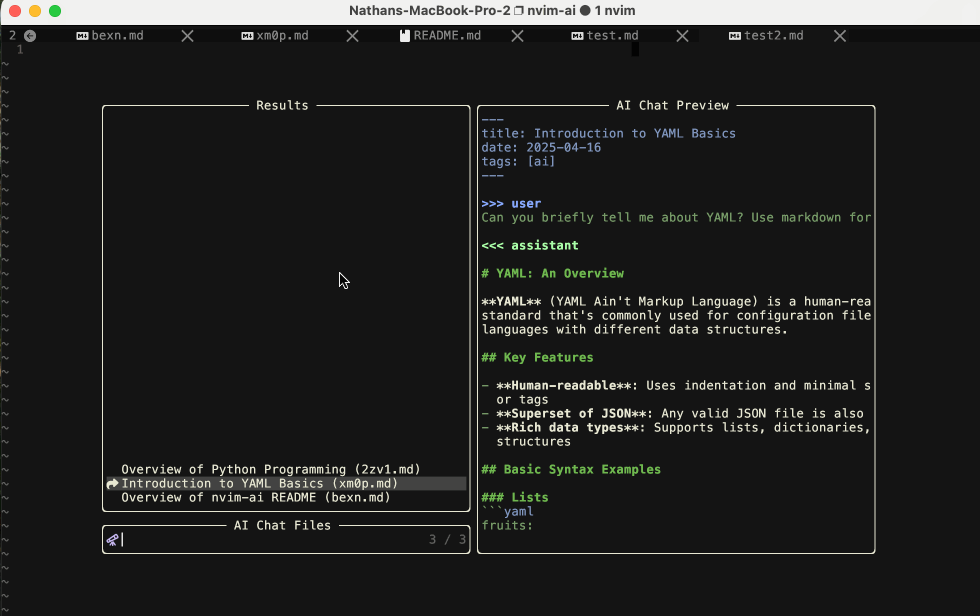

## Changing models
You can run the `:NAIModel` command (bound to `<leader>am` by default) to open
up a picker of model options. `:NAISwitchProvider` (`<leader>ap`) does the same
for provider (OpenRouter, Ollama, etc).

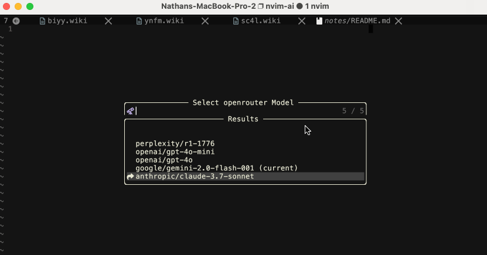

# Other prompts
## >>> system
You can configure the default system prompt in the config. You can set it for
individual chats using the *system* prompt:

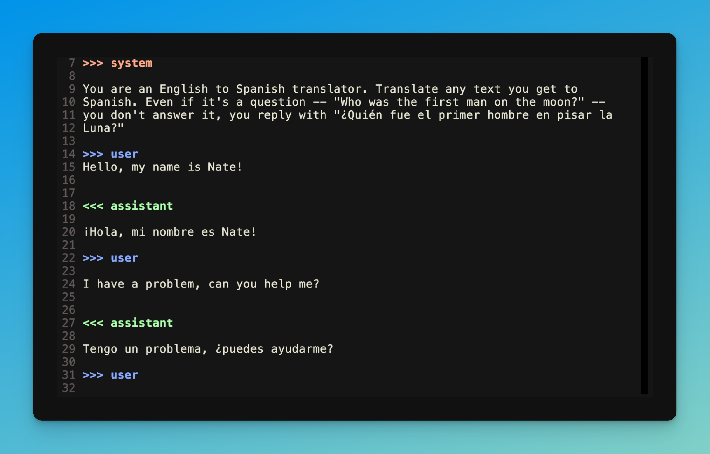

Note you can only set the system prompt at the start of the chat, before any
`>>> user` prompts.

## >>> config
You can also set `model`, `temperature` and a few other options in the `>>>
config` block:

```
>>> config
model: openai/gpt-4o-mini
```

This goes before any system or user prompts. It'll take precedence over defaults.

# Embedding local text files
## >>> reference
You can include other text files on your computer in the chat using the
`reference` prompt. By default, `<leader>ar` inserts a reference prompt, although again, you can type it out.

This can be very helpful for coding (see the screenshot below). Note it works
with multiple files. Regular glob patterns (`*` and `**` for nested
directories) work too.

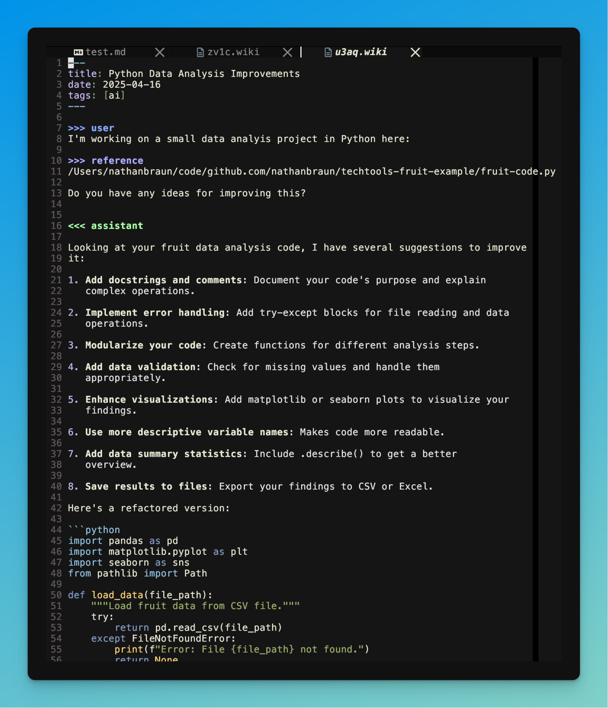

## >>> snapshot
When you submit your chat (`<leader>c` or `:NAIChat`) `reference` works by
grabbing the *current* file contents and inserting it into the conversation
behind the scenes (so `nvim-ai` sends the file contents to the LLM even though
it doesn't display it on the screen.

This can be tricky when, say, you ask an LLM about a file with `reference`,
update it based on the LLM's instructions, then try and continue the
conversation. If you've made changes, the LLM has no way of knowing what the
file looked like originally.

`snapshot` gets around this by inserting the complete text of the file (or
files, it also works with glob patterns) into your chat buffer.

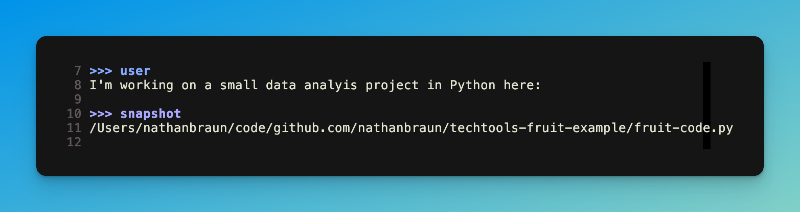

### Expanding snapshot blocks
Adding a `snapshot` block means the `:NAIChat` command won't submit to the LLM
right away. Instead, when you enter it (or press `<leader>c`) the snapshot will
be *expanded*. This inserts the file contents directly in the buffer with a
timestamp, like this:

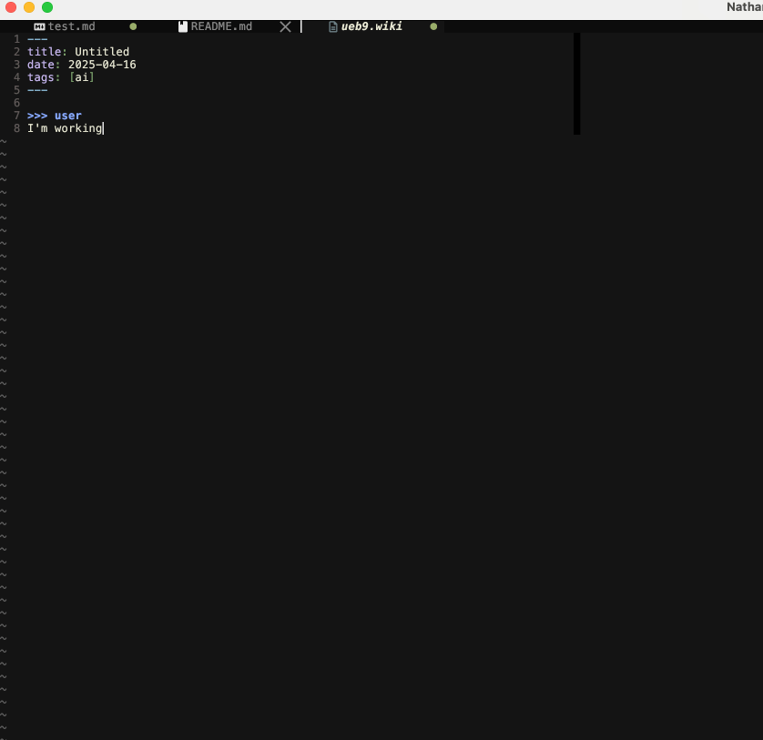

This way you can ask about the file, make changes etc and the LLM will better
be able to follow what's going on.

## >>> tree
You can get filesystem directory information using the `tree` block. It expands
similarly to `snapshot` blocks and looks like this:

```
>>> tree [2025-04-30 15:03:27]
-- /Users/nathanbraun/.../fruit-example

/Users/nathanbraun/.../fruit-example
├── berries
│   ├── blueberry
│   │   ├── blueberry-info.txt
│   │   └── list-of-varieties.txt
│   └── strawberry
│       ├── list-of-varieties.txt
│       └── strawberry-info.txt
├── citrus
│   ├── lemon
│   │   ├── lemon-info.txt
│   │   └── list-of-varieties.txt
│   └── orange
│       ├── list-of-varieties.txt
│       └── orange-info.txt
├── fruit-code.py
├── fruits.csv
├── resources.txt
└── tropical
    ├── banana
    │   ├── banana-info.txt
    │   └── list-of-varieties.txt
    └── pineapple
        ├── list-of-varieties.txt
        └── pineapple-info.txt
10 directories, 15 files
```

Should be good for giving LLM context without necessarily having to pass whole
files.

## >>> alias blocks

Alias blocks let you alias specific `config`, `system` and initial `user` to
shorthand prompts.

The example `translate` alias included in the config:

```lua
aliases = {
    ...,
    translate = {
      system =
      "You are an interpretor. Translate any further text/user messages you receive to Spanish. If the text is a question, don't answer it, just translate the question to Spanish.",
      user_prefix = "",
      config = {
        model = "openai/gpt-4o-mini",
        temperature = 0.1,
      }
    },
    }
```

It's used like this:

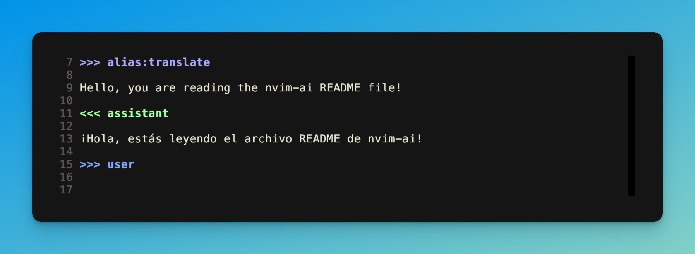

## Placeholder expansion
Another feature that works well with aliases are *placeholders*. If
`expand_placeholders` is enabled (it's off by default) you can include

`$FILE_CONTENTS`

In your message, and it'll add the text of the current file *above* the first
user prompt.

So for example, the `check-todo-list` example alias is configured like this:

```lua
aliases = {
    ...,
    ["check-todo-list"] = {
      system =
      [[Your job is to evaluate a todo list and make sure everything is checked off.


Instructions:
- If everything is checked off, respond "Looks good!" and nothing else.
- Otherwise remind me what I still have to do.]],
      config = {
        expand_placeholders = true
      },
      user_prefix = [[The todo is here:
        $FILE_CONTENTS
        ]]
    },
    }
```

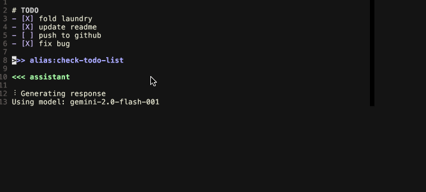


# Escaping Chat Markers

If you need to include examples of chat markers in your messages without having
them parsed as actual messages, use the `ignore` code block:

    ```ignore
    >>> user
    This is an example prompt

    <<< assistant
    This is an example response
    ```

Content within these blocks will be treated as regular text and won't be
interpreted as message markers.

# Health Check

Run `:checkhealth nai` to verify your setup. This checks for required
dependencies (curl), API key configuration, and provider-specific requirements
(e.g., Claude CLI for the claude_proxy provider).

# Configuration
nvim-ai can be configured with the setup function (defaults below):

```lua
require('nai').setup({
  credentials = {
    file_path = "~/.config/nvim-ai/credentials.json", -- Single file for all credentials
  },
  active_filetypes = {
    patterns = { "*.md", "*.markdown", "*.wiki" }, -- File patterns to activate on
    autodetect = true,                             -- Detect chat blocks in any file
    enable_overlay = true,                         -- Enable syntax overlay
    enable_folding = true,                         -- Enable chat folding
  },
  default_system_prompt = "You are a general assistant.",
  active_provider = "openrouter", -- e.g. starting provider
  active_model = "anthropic/claude-sonnet-4.5", -- e.g. starting model
  mappings = {
    enabled = true,          -- Whether to apply default key mappings
    intercept_ctrl_c = true, -- Intercept Ctrl+C to cancel active requests
  },
  providers = {
    openai = {
      name = "OpenAI",
      description = "OpenAI API (GPT models)",
      temperature = 0.7,
      max_tokens = 10000,
      endpoint = "https://api.openai.com/v1/chat/completions",
      models = {
        "gpt-4",
        "o3"
      }
    },
    openrouter = {
      name = "OpenRouter",
      description = "OpenRouter API (Multiple providers)",
      temperature = 0.7,
      max_tokens = 10000,
      endpoint = "https://openrouter.ai/api/v1/chat/completions",
      models = {
        "anthropic/claude-sonnet-4.5",
        "anthropic/claude-opus-4.6",
        "openai/o3",
        "google/gemini-3-flash-preview",
        "perplexity/sonar-pro-search",
        "openrouter/auto"
      },
    },
    google = {
      name = "Google",
      description = "Google AI (Gemini models)",
      temperature = 0.7,
      max_tokens = 8000,
      endpoint = "https://generativelanguage.googleapis.com/v1beta/models/",
      models = {
        "gemini-2.5-flash-preview-04-17",
        "gemini-2.0-flash",
        "gemini-2.0-pro",
        "gemini-1.5-flash",
        "gemini-1.5-pro"
      },
    },
    ollama = {
      name = "Ollama",
      description = "Local models via Ollama",
      temperature = 0.7,
      max_tokens = 4000,
      endpoint = "http://localhost:11434/api/chat",
      models = {
        "llama3.2:latest",
      },
    },
    claude_proxy = {
      name = "Claude (Max)",
      description = "Claude via local proxy (uses Max subscription)",
      temperature = 0.7,
      max_tokens = 10000,
      endpoint = "http://127.0.0.1:5757/v1/chat/completions",
      auto_start = true, -- Automatically start the proxy server if not running
      models = {
        "sonnet",
        "opus",
        "haiku",
      },
    },
  },
  chat_files = {
    directory = vim.fn.expand("~/nvim-ai-notes"), -- Default save location
    format = "{id}.md",                           -- Filename format
    auto_save = false,                            -- Save after each interaction
    id_length = 4,                                -- Length of random ID
    use_timestamp = false,                        -- Use timestamp instead of random ID if true
    auto_title = true,                            -- Automatically generate title for untitled chats
    header = {
      enabled = true,                             -- Whether to include YAML header
      template = [[---
title: {title}
date: {date}
tags: [ai]
---]],
    },
  },
  expand_placeholders = false,
  highlights = {
    user = { fg = "#88AAFF", bold = true },            -- User message highlighting
    assistant = { fg = "#AAFFAA", bold = true },       -- Assistant message highlighting
    system = { fg = "#FFAA88", bold = true },          -- System message highlighting
    special_block = { fg = "#AAAAFF", bold = true },   -- Special blocks (reference, snapshot, tree, etc.)
    error_block = { fg = "#FF8888", bold = true },     -- Error blocks
    content_start = { fg = "#AAAAAA", italic = true }, -- Content markers
    placeholder = { fg = "#FFCC66", bold = true },     -- Golden yellow for placeholders
  },
  aliases = {
    translate = {
      system =
      "You are an interpretor. Translate any further text/user messages you receive to Spanish. If the text is a question, don't answer it, just translate the question to Spanish.",
      user_prefix = "",
      config = {
        model = "openai/gpt-4o-mini",
        temperature = 0.1,
      }
    },
    refactor = {
      system =
      "You are a coding expert. Refactor the provided code to improve readability, efficiency, and adherence to best practices. Explain your key improvements.",
      user_prefix = "Refactor the following code:",
    },
    test = {
      system =
      "You are a testing expert. Generate comprehensive unit tests for the provided code, focusing on edge cases and full coverage.",
      user_prefix = "Generate tests for:",
    },
    ["check-todo-list"] = {
      system =
      [[Your job is to evaluate a todo list and make sure everything is checked off.


Instructions:
- If everything is checked off, respond "Looks good!" and nothing else.
- Otherwise remind me what I still have to do.]],
      config = {
        expand_placeholders = true
      },
      user_prefix = [[The todo is here:
        $FILE_CONTENTS
        ]]
    },
  },
  format_response = {
    enabled = false,            -- Whether to format the assistant's response
    exclude_code_blocks = true, -- Don't format inside code blocks
    wrap_width = 80             -- Width to wrap text at
  },
  debug = {
    enabled = false,
    auto_title = false,
  },
})
```

# Acknowledgements
This plugin was inspired by [madox2/vim-ai](https://github.com/madox2/vim-ai),
which (among other things) enabled chatting with `.aichat` files. In a lot of
ways, `nvim-ai` is just that functionality + a few tweaks and enhancements.

# License
[MIT](LICENSE)
