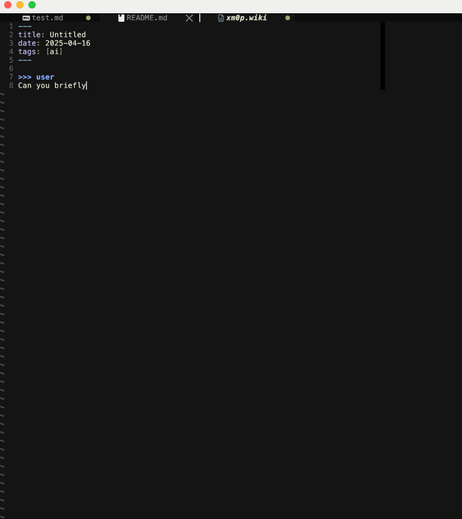
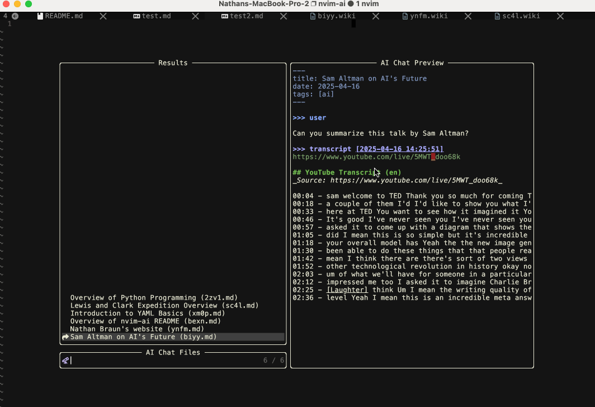
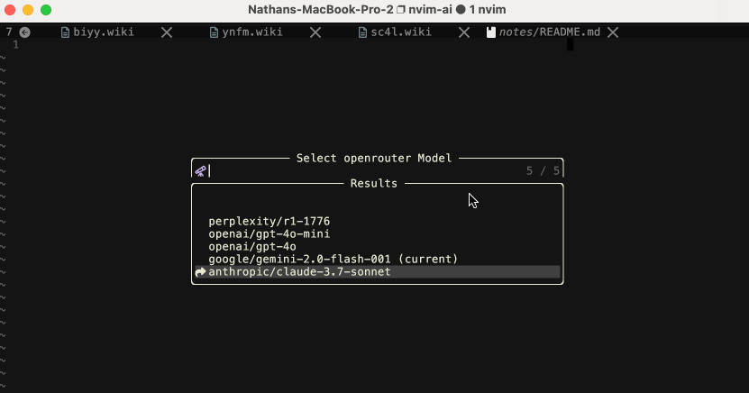
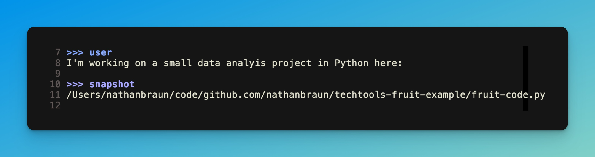
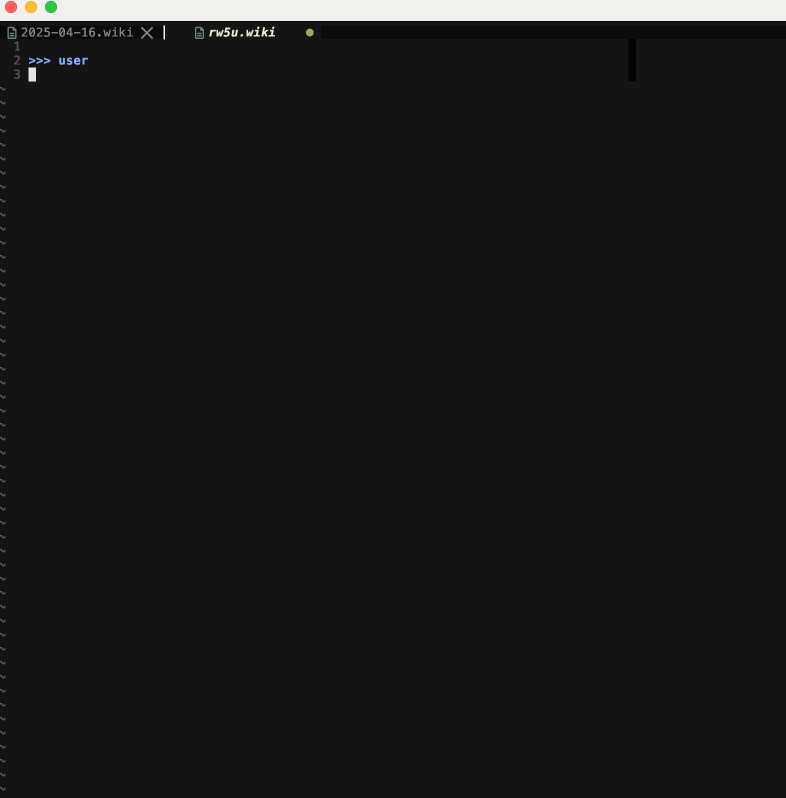
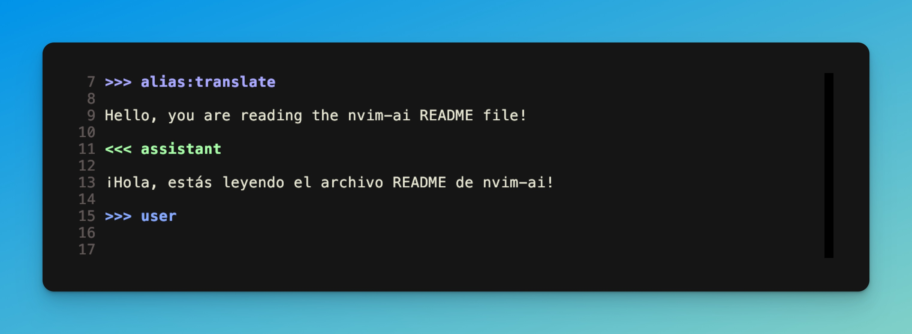
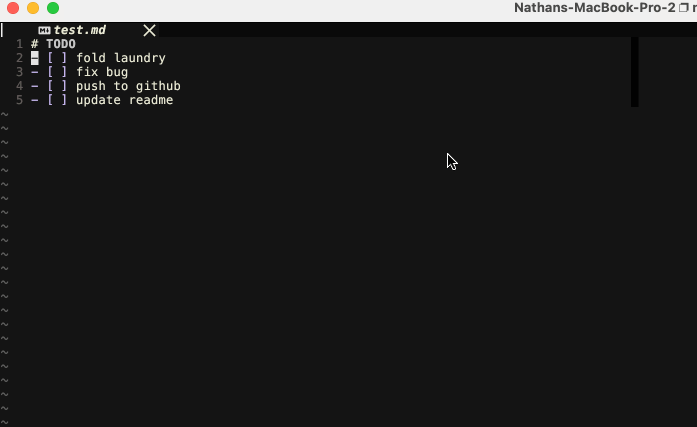
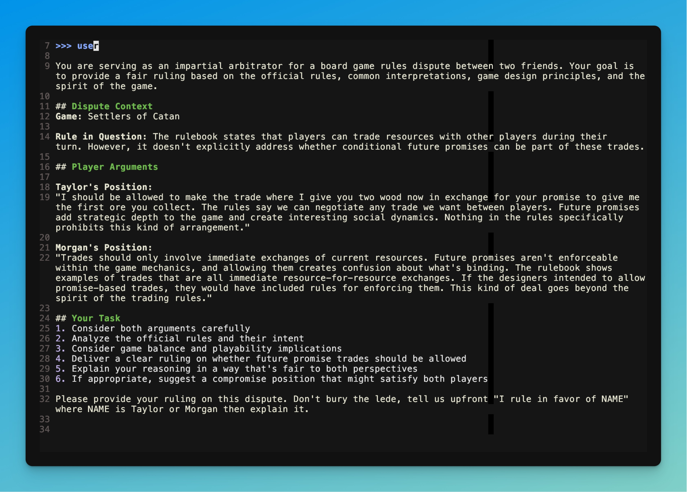
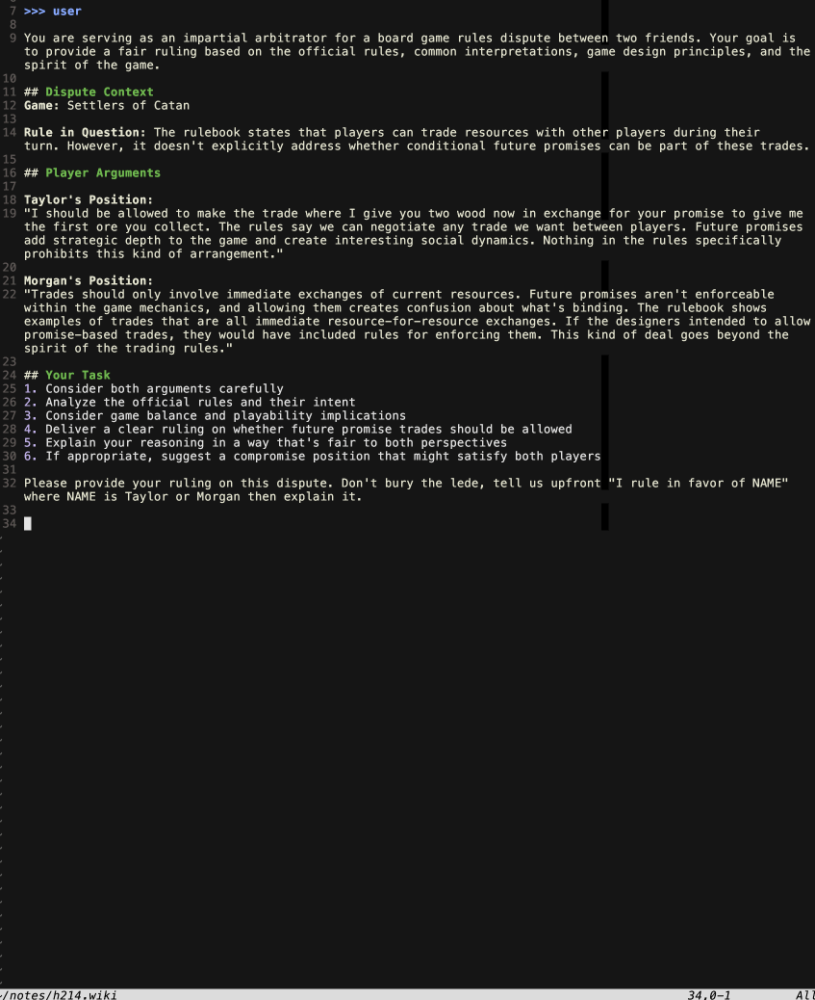

# nvim-ai
LLM chats as text files inside Neovim.


## Features
- Chat with any LLM inside any text file.
- Persistent. Save conversations as text files. Pick them up later and continue
  chatting. View, edit and regenerate conversation history.
- Works with OpenAI, Google, OpenRouter or locally with Ollama.
- Embed local text files, websites or YouTube video transcripts (requires
  [Dumpling API](https://dumplingai.com) key).
- Configurable provider, model, temperature and system prompt.
- Sign conversations — i.e. prove/verify text matches LLM output without edits.
- No language dependencies, written in Lua.
- Asynchronous.
- Auto topic/title detection.
- Lightweight (it'll respect your current syntax rules) syntax and folding.

## Table of Contents
- [Prerequisites](#prerequisites)
- [Creating a new conversation](#creating-a-new-conversation)
- [Viewing previous conversations](#viewing-previous-conversations)
- [Changing models](#changing-models)
- [Other prompts](#other-prompts)
- [Embedding local text files and web content](#embedding-local-text-files-and-web-content)
- [Alias blocks](#>>>-alias-blocks)
- [Dumpling AI](#dumpling-ai)
- [Verifying Chats](#verifying-chats)
- [Configuration](#configuration)

## Prerequisites
You'll need an OpenRouter (recommended), OpenAI or Google AI API key. *Or* an
instance of Ollama running on your computer.

You can get an OpenRouter key here:

[https://openrouter.ai/](https://openrouter.ai/)

## Installation

<details>
  <summary>lazy.nvim</summary>

```lua
{
    'nathanbraun/nvim-ai',
    dependencies = {
        'nvim-telescope/telescope.nvim', -- Optional, for model selection
    },
    config = function()
        require('nai').setup({
            -- Your configuration here (see Configuration section)
        })
    end
}
```
</details>

<details>
  <summary>packer.nvim</summary>

```lua
use {
    'nathanbraun/nvim-ai',
    requires = {
        'nvim-telescope/telescope.nvim', -- Optional, for model selection
    },
    config = function()
        require('nai').setup({
            -- Your configuration here (see Configuration section)
        })
    end
}
```
</details>

After installing the plugin and getting your API key, open up Neovim and run:

```
:NAISetKey openrouter
```

It'll ask you for your API key. Paste it in. By default this will be saved at:

`~/.config/nvim-ai/credentials.json`

# Quickstart
## Your first conversation
By default, nvim-ai is enabled on markdown (`*.md`) and vimwiki (`*.wiki`)
files.

Most commands are prefixed with `<leader>a`.

So open up an empty markdown file and press `<leader>au`. This will insert a
*user* prompt (alternatively you can just type out `>>> user` -- it works the
same).

Type your message for the LLM below it and press `<leader>c`.

```
>>> user

Briefly tell me about Neovim.
```

If all is working well you should see a spinner and a note about generating the
response/model info. When it's ready it'll insert the response (under an `<<<
assistant` block) followed by another user prompt for you to follow up.


Try following up under the next `>>> user` prompt ("What year was it
released?") and press `<leader>c` again to continue the conversation.

This is a normal markdown file, and can be saved, closed etc. When you re-open
it you can continue chatting under additional `>>> user` blocks.

## Creating a new conversation
It can be cumbersome to deal with file and conversation management, and
`nvim-ai` can take care of that for you.

In Neovim, press `<leader>ai`.

By default (it's configurable) this creates a markdown file
`~/nvim-ai-notes/XXXX.md` where `XXXX` is a random string. The file starts off
with a YAML header and ready `user` prompt:

```markdown
---
title: Untitled
date: YYYY-MM-DD
tags: [ai]
---

>>> user
```

Try typing in a message ("Briefly tell me about YAML") and `:NAIChat`
(`<leader>c`) to send to the LLM.

If your note is "Untitled" the first time the LLM responds it'll automatically
fill it in for you (for me for this query Claude picked "Introduction to YAML
Basics"). This is all text -- and it won't change existing titles -- so feel
free to modify.



The is exactly the same as before -- it's still a normal markdown file and you
can save, close, pick up where you left off etc.

The benefits to chatting in dedicated files with `<leader>ai`:

1. Not having to think about where to store your markdown files and what to title or name them.
2. Putting them all in one spot makes it easier to view previous conversations.

## Viewing previous conversations

To view (and continue chatting with) past conversations run `:NAIBrowse`, which
is mapped to `<leader>ao` (for *open*) by default.

This will open up a picker (Snacks, Telescope or Fzf Lua) with the extracted
*titles* (from the YAML) of all your conversations in the `~/nvim-ai-notes`
directory.



## Changing models
You can run the `:NAIModel` command (bound to `<leader>am` by default) to open
up a picker of model options. `:NAIProvider` (`<leader>ap`) does the same for
provider (OpenRouter, Ollama, etc).



# Other prompts
## >>> system 
You can configure the default system prompt in the config. You can set it for
individual chats using the *system* prompt:


Note you can only set the system prompt at the start of the chat, before any
`>>> user` prompts.

## >>> config 
You can also set `model`, `temperature` and a few other options in the `>>>
config` block:

```
>>> config
model: openai/gpt-4o-mini
```

This goes before any system or user prompts. It'll take precedence over defaults.

# Embedding local text files and web content
## >>> reference 
You can include other text files on your computer in the chat using the
`reference` prompt. By default, `<leader>ar` inserts a reference prompt, although again, you can type it out.

This can be very helpful for coding (see the screenshot below). Note it works
with multiple files. Regular glob patterns (`*` and `**` for nested
directories) work too.


## >>> snapshot 
When you submit your chat (`<leader>c` or `:NAIChat`) `reference` works by
grabbing the *current* file contents and inserting it into the conversation
behind the scenes (so `nvim-ai` sends the file contents to the LLM even though
it doesn't display it on the screen.

This can be tricky when, say, you ask an LLM about a file with `reference`,
update it based on the LLM's instructions, then try and continue the
conversation. If you've made changes, the LLM has no way of knowing what the
file looked like originally.

`snapshot` gets around this by inserting the complete text of the file (or
files, it also works with glob patterns) into your chat buffer.



### Expanding snapshot blocks
Adding a `snapshot` block means the `:NAIChat` command won't submit to the LLM
right away. Instead, when you enter it (or press `<leader>c`) the snapshot will
be *expanded*. This inserts the file contents directly in the buffer with a
timestamp, like this:



This way you can ask about the file, make changes etc and the LLM will better
be able to follow what's going on.

## >>> web
You can get text data from simple websites using the `>>> web` block followed
by a URL. Behind the scenes it uses curl and
[html2text](https://github.com/grobian/html2text) or
[lynx](https://lynx.invisible-island.net/) and requires one of them be
installed.


## >>> alias blocks

Alias blocks let you alias specific `config`, `system` and initial `user` to
shorthand prompts.

The example `translate` alias included in the config:

```lua
aliases = {
    ...,
    translate = {
      system =
      "You are an interpretor. Translate any further text/user messages you receive to Spanish. If the text is a question, don't answer it, just translate the question to Spanish.",
      user_prefix = "",
      config = {
        model = "openai/gpt-4o-mini",
        temperature = 0.1,
      }
    },
    }
```

It's used like this:



## Placeholder expansion
Another feature that works well with aliases are *placeholders*. If
`expand_placeholders` is enabled (it's off by default) you can include

`$FILE_CONTENTS`

In your message, and it'll add the text of the current file *above* the first
user prompt.

So for example, the `check-todo-list` example alias is configured like this:

```lua
aliases = {
    ...,
    ["check-todo-list"] = {
      system =
      [[Your job is to evaluate a todo list and make sure everything is checked off.


Instructions:
- If everything is checked off, respond "Looks good!" and nothing else.
- Otherwise remind me what I still have to do.]],
      config = {
        expand_placeholders = true
      },
      user_prefix = [[The todo is here:
        $FILE_CONTENTS
        ]]
    },
    }
```




# Dumpling AI
The `web` prompt works on simple sites, but won't work on e.g. SPA's or
javascript-heavy content.

[Dumpling AI](https://www.dumplingai.com/) is a paid (though inexpensive)
service that provides a bunch of APIs to turn web content into LLM ready text.

They provide a decent amount of free trial credits, so I recommend checking it
out.

When you get a Dumpling AI API key you can tell `nvim-ai` about it by running:

```
:NAISetKey dumpling
```

and pasting it in. Once you enable Dumpling, you'll be able to use the
following prompts.

Note: in order to save on credits and not repeatedly call the Dumpling API,
**all of the dumpling prompts work similar to `snapshot`**. So `nvim-ai` will
use Dumpling to get the text, then insert it into your chat file.

## >>> scrape

Like `web` but uses Dumpling's APIs instead of `curl` and `html2text`, so it
works on more sites.

It also takes longer and is more expensive than `web` (which is free), so I'd
try `web` first and use `scrape` if it doesn't work.

Type it out or press `<leader>ad` (for AI *dumpling*) to insert.

## >>> crawl

Like `scrape` but will also scrape the pages a site links to up to a
configurable depth (defaults to 2). Uses more Dumpling credits.

Type it out or press `<leader>ac` to insert.

## >>> youtube
Will expand to a transcript of any YouTube video. After its expanded you can
follow up with user prompts to ask questions about the transcript.

# Verifying Chats
The point of `nvim-ai` is to chat with and edit LLM conversations in text
files, but sometimes (theoretically) you might want to "prove" than an AI
conversation is unaltered.

An example would be using an LLM as an arbitrator for dispute resolution. Say
you and a friend disagree — maybe you're playing a board game and there's
ambiguity in the rules — so you decide to each make your case and submit it to
`o3` to decide.



If you're chatting with the LLM in your text editor, you can't just show you're
friend:

```
>>> assistant
You are right, your friend is wrong.
```

How do they know that's what the LLM really said? Maybe *you* typed it. You're
chatting with an LLM in your text editor, you could have typed anything!

Instead you can submit your question to the LLM with `:NAISignedChat` to
"prove" a conversation is unaltered.

## How it works
In a signed chat, `nvim-ai` hashes the full conversation history and latest
response immediately after getting a reply from the LLM. It inserts that hash
into the buffer as a signature block.

Separately, the `:NAIVerify` command hashes the full buffer, compares it to the
signature, and displays the "Verified" text (as an extended mark) if it
matches.

Also:

- The hashing algorithm uses a persistent, secret key. This prevents the user
  from simply editing the text in the buffer, then re-hashing it and tampering
  with the signature themselves.
- As soon as the buffer is edited the "Verified" text disappears (since we can
  no longer guarantee it matches) but you can check it again by running
  `:NAIVerify`.

The hashing algorithm will ignore previous signature blocks and blank lines.
Other formatting changes count as differences.



## Caveats

Obviously this isn't perfect. Theoretically the user has control over the
plugin and could edit the LLM's response before it's hashed.

# Configuration
nvim-ai can be configured with the setup function (defaults below):

```lua
require('nai').setup({
  credentials = {
    file_path = "~/.config/nvim-ai/credentials.json", -- Single file for all credentials
  },
  active_filetypes = {
    patterns = { "*.md", "*.markdown", "*.wiki" }, -- File patterns to activate on
    autodetect = true,                             -- Detect chat blocks in any file
    enable_overlay = true,                         -- Enable syntax overlay
    enable_folding = true,                         -- Enable chat folding
  },
  default_system_prompt = "You are a general assistant.",
  active_provider = "openrouter", -- e.g. starting provider
  active_model = "google/gemini-2.0-flash-001", -- e.g. starting model
  mappings = {
    enabled = true,          -- Whether to apply default key mappings
    intercept_ctrl_c = true, -- New option to intercept Ctrl+C
    -- Default mappings will be used from the mappings module
  },
  providers = {
    openai = {
      name = "OpenAI",
      description = "OpenAI API (GPT models)",
      temperature = 0.7,
      max_tokens = 10000,
      endpoint = "https://api.openai.com/v1/chat/completions",
      models = {
        "gpt-4",
        "o3"
      }
    },
    openrouter = {
      name = "OpenRouter",
      description = "OpenRouter API (Multiple providers)",
      temperature = 0.7,
      max_tokens = 10000,
      endpoint = "https://openrouter.ai/api/v1/chat/completions",
      models = {
        "anthropic/claude-3.7-sonnet",
        "google/gemini-2.0-flash-001",
        "openai/gpt-4o",
        "openai/gpt-4o-mini",
        "perplexity/r1-1776",
      },
    },
    google = {
      name = "Google",
      description = "Google AI (Gemini models)",
      temperature = 0.7,
      max_tokens = 8000,
      endpoint = "https://generativelanguage.googleapis.com/v1beta/models/",
      models = {
        "gemini-2.5-flash-preview-04-17",
        "gemini-2.0-flash",
        "gemini-2.0-pro",
        "gemini-1.5-flash",
        "gemini-1.5-pro"
      },
    },
    ollama = {
      name = "Ollama",
      description = "Local models via Ollama",
      temperature = 0.7,
      max_tokens = 4000,
      endpoint = "http://localhost:11434/api/chat",
      models = {
        "llama3.2:latest",
      },
    },
  },
  chat_files = {
    directory = vim.fn.expand("~/nvim-ai-notes"), -- Default save location
    format = "{id}.md",                           -- Filename format
    auto_save = false,                            -- Save after each interaction
    id_length = 4,                                -- Length of random ID
    use_timestamp = false,                        -- Use timestamp instead of random ID if true
    auto_title = true,                            -- Automatically generate title for untitled chats
    header = {
      enabled = true,                             -- Whether to include YAML header
      template = [[---
title: {title}
date: {date}
tags: [ai]
---]],
    },
  },
  tools = {
    dumpling = {
      base_endpoint = "https://app.dumplingai.com/api/v1/", -- Base endpoint for all Dumpling API calls
      format = "markdown",                                  -- Output format: markdown, html, or screenshot
      cleaned = true,                                       -- Whether to clean the output
      render_js = true,                                     -- Whether to render JavaScript
      max_content_length = 100000,                          -- Max length to prevent excessively large responses
      include_timestamps = true,                            -- Whether to include timestamps in the output
    },
  },
  expand_placeholders = false,
  highlights = {
    user = { fg = "#88AAFF", bold = true },            -- User message highlighting
    assistant = { fg = "#AAFFAA", bold = true },       -- Assistant message highlighting
    system = { fg = "#FFAA88", bold = true },          -- System message highlighting
    special_block = { fg = "#AAAAFF", bold = true },   -- Special blocks (scrape, youtube, etc.)
    error_block = { fg = "#FF8888", bold = true },     -- Error blocks
    content_start = { fg = "#AAAAAA", italic = true }, -- Content markers
    placeholder = { fg = "#FFCC66", bold = true },     -- Golden yellow for placeholders
    signature = { fg = "#777777", italic = true },     -- Gray for signature lines
  },
  aliases = {
    translate = {
      system =
      "You are an interpretor. Translate any further text/user messages you receive to Spanish. If the text is a question, don't answer it, just translate the question to Spanish.",
      user_prefix = "",
      config = {
        model = "openai/gpt-4o-mini",
        temperature = 0.1,
      }
    },
    refactor = {
      system =
      "You are a coding expert. Refactor the provided code to improve readability, efficiency, and adherence to best practices. Explain your key improvements.",
      user_prefix = "Refactor the following code:",
    },
    test = {
      system =
      "You are a testing expert. Generate comprehensive unit tests for the provided code, focusing on edge cases and full coverage.",
      user_prefix = "Generate tests for:",
    },
    ["check-todo-list"] = {
      system =
      [[Your job is to evaluate a todo list and make sure everything is checked off.


Instructions:
- If everything is checked off, respond "Looks good!" and nothing else.
- Otherwise remind me what I still have to do.]],
      config = {
        expand_placeholders = true
      },
      user_prefix = [[The todo is here:
        $FILE_CONTENTS
        ]]
    },
  },
  verification = {
    enabled = false,            -- Whether to enable response verification
    highlight_verified = true, -- Highlight verified responses
  },
  format_response = {
    enabled = false,            -- Whether to format the assistant's response
    exclude_code_blocks = true, -- Don't format inside code blocks
    wrap_width = 80             -- Width to wrap text at
  },
  debug = {
    enabled = false,
    auto_title = false,
  },
})
```

# Acknowledgements
This plugin was inspired by [madox2/vim-ai](https://github.com/madox2/vim-ai),
which (among other things) enabled chatting with `.aichat` files. In a lot of
ways, `nvim-ai` is just that functionality + a few tweaks and enhancements.

# License
[MIT](LICENSE)
